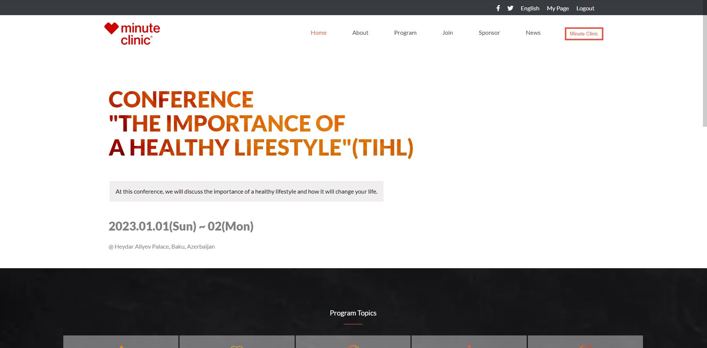

# 

# Capstone
> The Website is for a Minute Clinic. One of the many main activities of this clinic is the importance of a healthy lifestyle and how it will change your life. The coming CONFERENCE "THE IMPORTANCE OF A HEALTHY LIFESTYLE"(TIHL) is hosting on 01/01/2023.

## Built With

- HTML
- CSS
- JavaScript

## Live Demo

[Github Pages Link](https://fuadnabi.github.io/Week-One-Capstone/)

### Setup
If you want to try this application locally, follow the steps below:

1. Clone the project using git clone `git@github.com:FuadNabi/Week-One-Capstone.git`.

2. Run `cd Week-One-Capstone`.

3. install a live server extension

4. Right-click on the index.html file

5. Select the open file with a live server

## Authors

👤 **Fuad Nabiyev**

- GitHub: [@FuadNabi](https://github.com/FuadNabi)

- LinkedIn: [Fuad Nabiyev](https://www.linkedin.com/in/fuad-nabiyev/)

## 🤝 Contributing

Contributions, issues, and feature requests are welcome!

Feel free to check the [issues page](https://github.com/FuadNabi/Week-One-Capstone/issues).

## Show your support

Give a ⭐️ if you like this project!

## Acknowledgments

- Hat tip to anyone whose code was used
- Inspiration
- etc

## 📝 License

This project is [MIT](https://github.com/FuadNabi/Week-One-Capstone/blob/main/LICENSE) licensed.

_NOTE: we recommend using the [MIT license](https://choosealicense.com/licenses/mit/) - you can set it up quickly by [using templates available on GitHub](https://docs.github.com/en/communities/setting-up-your-project-for-healthy-contributions/adding-a-license-to-a-repository). You can also use [any other license](https://choosealicense.com/licenses/) if you wish._
